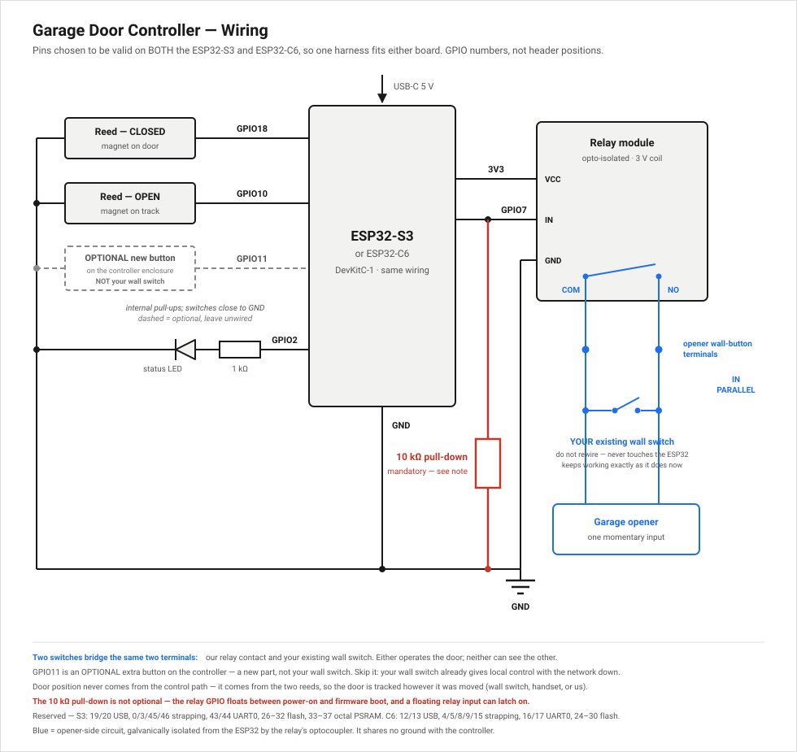

# esphome-garage-door

Self-hosted ESPHome firmware for an **ESP32-S3 or ESP32-C6** garage door controller with
**two endstop sensors** and a real state machine. A fork-in-spirit of Athom's
`athom-garage-door.yaml`, rebuilt to remove its weaknesses:

| Upstream weakness | Fix here |
|---|---|
| One reed switch → cover is binary, never OPENING/CLOSING/partial | Two endstops + 7-state machine |
| Contact input on the USB D− pin | Pin map avoids USB and strapping pins |
| `update:` points at Athom's manifest → updates silently revert your config | Self-hosted build + manifest (GitHub Actions → Pages) |
| No travel timeout → jammed door reports a state that never happened | Timeout → explicit `FAULT_TIMEOUT`, commands refused until cleared |
| Floating contact input | Explicit `INPUT_PULLUP`, both edges debounced 50 ms |
| Relay GPIO floats during boot | Hardware 10 kΩ pull-down **and** 3 s boot suppression |
| `stop_action` blindly pulses (reverses many openers) | Opener cycle modelled explicitly (`opener_cycle_mode`) |
| BLE proxy at ~94 % RX duty cycle starves WiFi | 9 % duty cycle, scan gated on API connection, optional package |
| Factory reset = 4 s hold of the door button | Factory reset is an HA config entity only |

## Governing design principle

**The door must work with the network down.**

- **Tier 1 — must never fail:** endstop sensing, state machine, relay pulse.
  Entirely on-device; no WiFi/API/DNS dependency. There is deliberately no
  button on the controller: your opener's existing wall switch is untouched,
  sits in parallel with the relay, and works even if this device is unplugged.
- **Tier 2 — should work:** HA cover entity, diagnostics, OTA.
- **Tier 3 — disposable:** the BLE proxy. First to degrade, last to get
  resources. Delete one line in `garage-door.yaml` to drop it.

## Hardware

**Either** an ESP32-S3-DevKitC-1-N16R8 or an ESP32-C6-DevKitC-1-N8, plus a
1-channel opto-isolated relay module (**3 V or 5 V coil** — a supply link takes
either), two reed switches, and a **mandatory 10 kΩ pull-down on the relay
GPIO**.

| Board | Entry point | Why |
|---|---|---|
| ESP32-S3-DevKitC-1-N16R8 | `garage-door.yaml` | Dual core + 8 MB PSRAM — the better BLE proxy host |
| ESP32-C6-DevKitC-1-N8 | `garage-door-c6.yaml` | Cheaper/more available; adds a Thread/Zigbee radio |

**The pin map is identical for both** — chosen from GPIOs that are free on
either chip, so one wiring harness fits and swapping boards needs no rewiring.
CI builds both and the parity check keeps every non-board setting in sync.

Full pin map, polarity check and component notes: [docs/wiring.md](docs/wiring.md).
What to order and why this part: [docs/bom.md](docs/bom.md).

## Install

1. Copy the entry point for your board (`garage-door.yaml` for the S3,
   `garage-door-c6.yaml` for the C6) and set the substitutions (WiFi, polarity).
2. First flash by USB: `esphome run <your-entry-point>.yaml`, or use the
   [hosted web flasher](https://cgnschris.github.io/esphome-garage-door/),
   which detects which chip you plugged in and flashes the matching image.
3. Calibrate: [docs/calibration.md](docs/calibration.md) — determines
   `opener_cycle_mode`, `open_duration`, `close_duration`.
4. **Run the bench acceptance tests below before wiring the relay to the
   opener.**

Adopting via the ESPHome dashboard uses `dashboard_import` pointing at
**this** repo, never upstream.

## The state machine

States: `CLOSED, OPEN, OPENING, CLOSING, STOPPED_PARTIAL, FAULT_TIMEOUT,
FAULT_SENSOR` (+ boot-time `UNKNOWN`). Exposed as a position-capable template
cover, a `Door State` text sensor, and a `Fault` binary sensor
(`device_class: problem`) with a `Clear Fault` button. Position between the
endstops is a time-based estimate that snaps to exactly 0/1 at each endstop.

Faults refuse commands — the firmware never retries into a jam.

### Why not the built-in `endstop` or `feedback` cover platforms

Both were evaluated. **Do not "simplify" back to them:**

- **`endstop`** automatically fires `stop_action` on arrival at an endstop.
  On a one-button opener `stop_action` is "press the button" — so arriving at
  open would press again and start the door closing. Actively harmful.
- **`feedback`** (`has_built_in_endstop: true`) avoids that trap but assumes
  independently commandable open/close actions, which a single momentary
  button is not.

Neither models the ambiguity of a mid-travel command on a one-button opener.
See [docs/opener-compatibility.md](docs/opener-compatibility.md) for the
pulse-count logic (including one deliberate deviation from the original
design brief, documented there).

## OTA / self-hosting

GitHub Actions builds every push to `main` with `esphome/build-action@v8.0.0`
and publishes to GitHub Pages:

- `/index.html` — esp-web-tools USB flasher, chip auto-detecting
- `/firmware/s3/`, `/firmware/c6/` — factory + OTA binaries per variant
- `/firmware/manifest.json` — esp-web-tools manifest, one `builds` array
  covering both chips; esp-web-tools probes the board over serial and picks
  the matching entry
- `/manifest.json` — OTA manifest, also one `builds` array. Each device
  matches its own `chipFamily`, so a single URL serves both variants and an
  S3 can never pull C6 firmware. Served from Pages, not Releases, because
  Releases redirects overflow the http_request buffer

TLS verification ships **off** (`ota_verify_ssl: "false"`) and is documented
inline in `packages/core.yaml`: firmware integrity is gated by the manifest
MD5, not by transport security, which is acceptable only because the manifest
source is this repo. Do not point `ota_update_url` at anything you do not
control.

It is a substitution rather than a hard-coded value because the original
reason for disabling it — TLS validation costing heap the C6 didn't have — is
much weaker on an S3 with PSRAM. Flip it to `"true"` once you can watch a real
OTA complete on the bench; it ships off because a failed handshake breaks OTA
silently and it has not been tested on hardware.

**Repo setup:** Settings → Pages → Source = *GitHub Actions*.

## Home Assistant extras

`ha/automations.yaml` — left-open alert and a prominent fault alert.
`ha/dashboard.yaml` — a status card.

**Auto-close is deliberately out of scope for v1.** Unattended closing
requires an audible + visual warning sequence before movement — a hardware
change (buzzer + beacon) and a safety design conversation, not a firmware
toggle.

## Bench acceptance tests

Nothing gets wired to the opener until all of these pass. Multimeter on the
relay contacts for 1.

1. Power-cycle 10× (plus a browned-out supply): the relay must never close.
2. Boot with no endstop active → `Door State` = **UNKNOWN**; the cover reports
   **open (100 %)**, `IDLE`, and never CLOSED. (An ESPHome cover cannot be
   "unknown" — the API always sends a position — so open is the fail-safe.)
3. Boot with both endstops active → `FAULT_SENSOR`, `Fault` on, commands refused.
   Toggle either reed: the fault must **stay latched** until Clear Fault.
4. Simulated open cycle (move the magnet by hand): CLOSED → open command →
   OPENING with interpolating position → open endstop → OPEN, position 1.0.
5. Simulated close cycle: mirror, position 0.0.
6. Auto-reverse: while CLOSING, trigger the *open* endstop → OPEN, not a fault.
7. Timeout: command open, never trigger an endstop → `FAULT_TIMEOUT`, `Fault`
   on, further commands refused until cleared.
8. Mid-travel reverse: while OPENING, command close; count relay clicks
   against the table in docs/opener-compatibility.md.
9. **Network down (the Tier 1 test):** WiFi disabled entirely — the state
   machine must still track both endstops and publish internal state to the
   log. Commanding the door offline is your wall switch's job, not this
   device's; confirm the controller follows the door when the switch moves it.
10. OTA: publish a build, confirm the update entity appears, installs, and
    comes back with pins intact.
11. `esphome config` validates clean for **both** entry points, the variant
    parity check passes, and CI is green — all before any hardware is involved.
